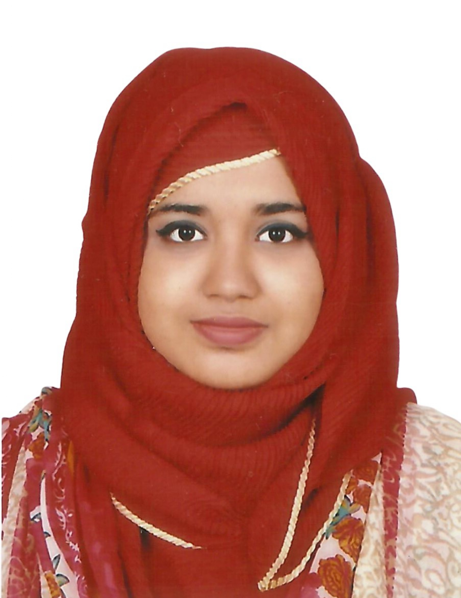

::: {.hero-box}

::: {.columns}

::: {.column width="65%"}

## Hello, I'm Maisha Munawara Hridy.

I am an MBA candidate in Business Analytics with experience across fintech, healthcare, customer service, and small business operations.

My work focuses on data-informed decision making, digital operations, and process improvement to support effective business performance.

[View Projects](projects.qmd){.btn-primary}
[Contact Me](contact.qmd){.btn-secondary}

:::

::: {.column width="35%"}

::: {style="text-align: right;"}
{.profile-photo}
:::

:::

:::

:::

## About Me

I am currently pursuing an MBA in Business Analytics at University Canada West. My background combines technical training in computer science with professional experience in digital services, customer operations, and data-driven problem solving.

I am particularly interested in roles that involve business analytics, operations improvement, and data-supported decision making.

---

## What I Bring

::: {.columns}

::: {.column width="33%"}

::: {.card-box}
### Analytical Thinking
I apply structured analysis and problem-solving to support data-informed business decisions.
:::

:::

::: {.column width="33%"}

::: {.card-box}
### Operational Insight
I bring experience in customer-facing and service environments where efficiency and process improvement matter.
:::

:::

::: {.column width="33%"}

::: {.card-box}
### Cross-Functional Collaboration
I have worked across teams and responsibilities, supporting communication, coordination, and performance improvement.
:::

:::

:::

---

## Career Interests

Business Analyst | Operations Analyst | Digital Operations Analyst | Data Analyst | Business Systems Analyst | Consulting Associate | Management Trainee

---

## Quick Links

- 📄 [Professional Experience](resume.qmd)
- 📊 [Signature Projects](projects.qmd)
- 🧠 [Skills & Certifications](skills.qmd)
- 🤝 [Leadership & Community Involvement](leadership.qmd)
- ✉️ [Contact](contact.qmd)